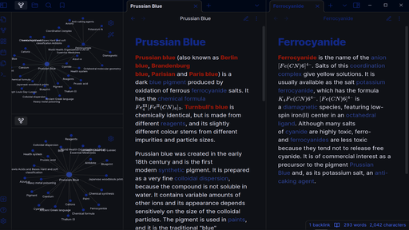
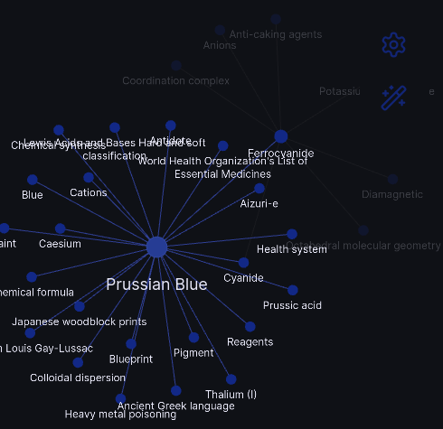

# Prussian-Blue
An obsidian theme inspired by Prussian Blue, the colour. Derived from the ProtocolBlue theme.

## Showcase:

---

---

## Important note:
In compliance with the original license of the ProtocolBlue theme, please note that Cosmodium CyberSecurity and any other contributors to the ProtocolBlue theme are NOT endorsing this theme.

## Credits:
- [ProtocolBlue theme](https://github.com/PrettyBoyCosmo/ProtocolBlue)
- [Prussian Blue page on Wikipedia](https://en.wikipedia.org/wiki/Prussian_blue)
- [Ferrocyanide page on Wikipedia](https://en.wikipedia.org/wiki/Ferrocyanide)
